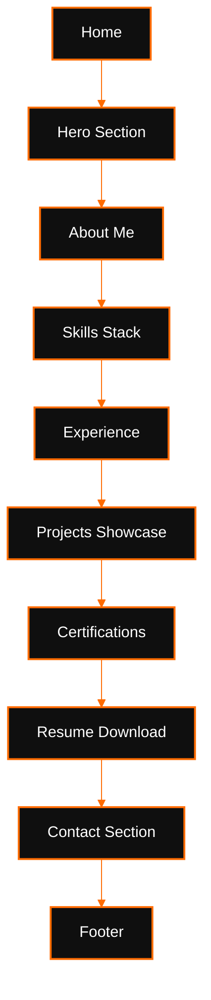
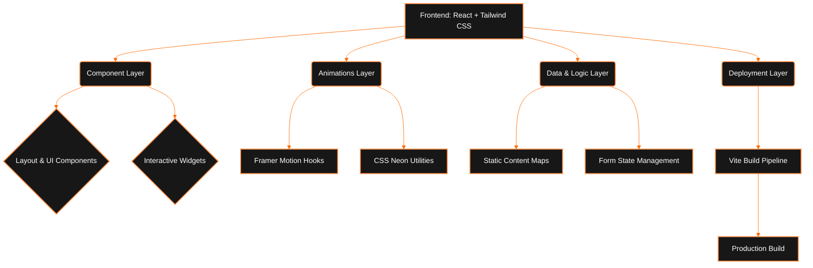

# Abhishek Gupta - Personal Portfolio

A cinematic, futuristic, and fully responsive personal portfolio built with a premium Cyberpunk/TRON-inspired aesthetic. This project showcases my experience, skills, and projects as a Software Engineering Intern and CS student.

## Technologies Used
- React.js (Vite)
- Tailwind CSS
- Framer Motion (Animations)
- Lucide React (Icons)
- TypeScript

---

## 🏗️ Flowcharts

### 1. Website Architecture Flowchart

### 2. Developer Architecture Flowchart

## Setup Instructions

1. Clone the repository.
2. Install dependencies: `npm install`
3. Start the development server: `npm run dev`
4. To build for production: `npm run build`
